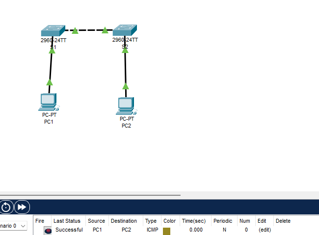

## TP 4 — Configuration de base d’un commutateur

Ce TP porte sur la configuration initiale de deux commutateurs Cisco dans un réseau local.  
Il comprend la vérification de la configuration par défaut, l’attribution d’un nom aux switches, la sécurisation de l’accès console et du mode privilégié avec des mots de passe, la mise en place d’une bannière MOTD, puis l’enregistrement de la configuration en NVRAM.

Le TP inclut également la configuration des postes clients, l’attribution d’adresses IP de gestion aux commutateurs via l’interface VLAN 1, ainsi que des tests de connectivité pour valider le bon fonctionnement du réseau.

**Compétences mobilisées :**
- Configuration initiale d’un switch Cisco
- Sécurisation de l’accès CLI
- Console, `enable password` et `enable secret`
- Bannière MOTD
- Sauvegarde de configuration en NVRAM
- Configuration d’interface VLAN de gestion
- Tests de connectivité réseau (`ping`)