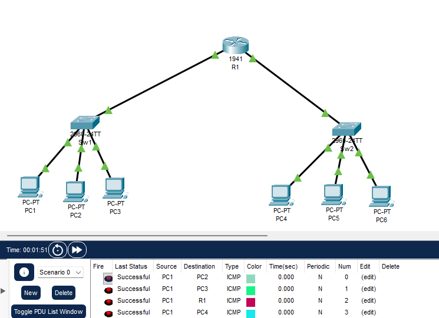
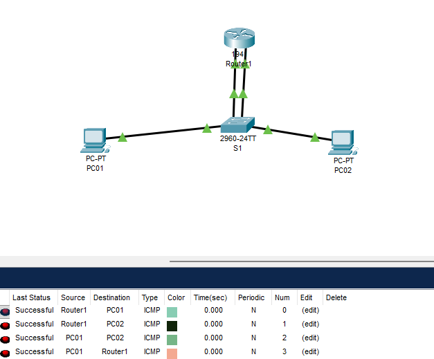

## TP 5 — Configuration d’une passerelle

Ce TP porte sur la configuration d’un routeur jouant le rôle de passerelle entre deux réseaux locaux distincts.  
L’objectif est de configurer les interfaces du routeur, attribuer les adresses IPv4 aux hôtes, définir les passerelles par défaut, puis vérifier la connectivité à l’intérieur d’un même LAN et entre deux LAN interconnectés.

Le TP permet de comprendre le rôle d’un routeur de niveau 3, le principe du routage IP et l’importance de la table de routage pour acheminer les paquets entre différents domaines de diffusion.

---
**Topologie 1 :**

---
**Topologie 2 :**

---

**Compétences mobilisées :**
- Configuration d’interfaces sur un routeur Cisco
- Adressage IPv4
- Passerelle par défaut
- Interconnexion de deux LAN
- Routage IP de base
- Tests de connectivité (`ping`)