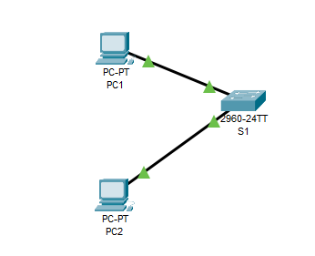
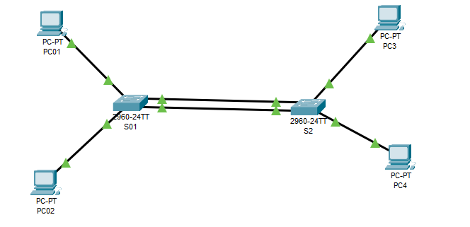
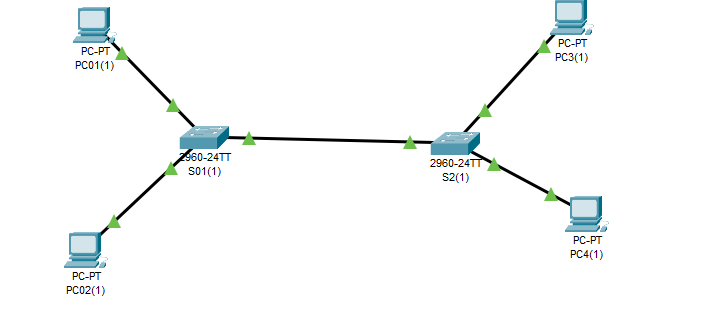

## TP 6 — Segmentation réseau par la mise en place de VLAN

Ce TP porte sur la segmentation logique d’un réseau local à l’aide de VLANs sous Cisco Packet Tracer.  
L’objectif est de créer et nommer plusieurs VLANs, d’affecter les ports des commutateurs aux VLANs correspondants, puis d’analyser l’impact de cette segmentation sur la connectivité entre les hôtes.

Le TP comprend ensuite un second scénario avec deux commutateurs, dans lequel la même configuration VLAN est reproduite, avant d’étudier la communication entre machines situées sur des switches différents.

Enfin, le TP introduit la configuration d’un lien **trunk** entre deux commutateurs afin de permettre le transport de plusieurs VLANs sur une même liaison et de rétablir la connectivité entre hôtes appartenant au même VLAN mais connectés à des switches distincts.

### Scénario 1 — VLANs sur un seul switch

### Scénario 2 — VLANs sur deux switches

### Scénario 3 — Trunk entre deux switches

**Compétences mobilisées :**
- Création et configuration de VLANs
- Affectation de ports en mode access
- Segmentation logique d’un réseau local
- Réduction des domaines de broadcast
- Analyse de la connectivité entre VLANs
- Configuration d’un trunk 802.1Q
- Administration de commutateurs Cisco